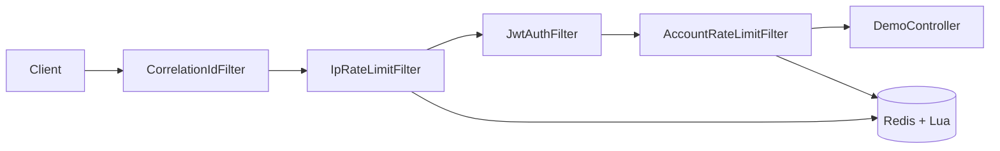

# Distributed Rate Limiter

[](https://github.com/muhammadahmed-01/DistributedRateLimiter/actions/workflows/ci.yml)


**Protect your API before abuse becomes an outage.**

This is a production-minded Spring Boot service that stops scrapers, credential-stuffing bursts, and runaway clients *before* they reach your business logic — using tiered limits (IP → JWT → account), atomic Redis+Lua sliding windows, and an observability stack you can actually trust.

> One abusive IP shouldn't decide your uptime. One compromised account shouldn't drain your Redis budget. This project shows how to say *no* early, *fairly*, and *measurably*.

---

## Why this exists

Every public API eventually faces the same moment: traffic spikes, bots show up, and someone asks *"Are we protected?"*

Most rate-limiter demos stop at a counter in memory. That breaks the second you add a second instance — or the first time someone exploits a window boundary.

This project answers a harder question: **how do you enforce fair, distributed limits under real concurrency, with metrics that prove it?**

| What keeps teams up at night | What this project demonstrates |
|------------------------------|--------------------------------|
| Bots hammering endpoints | IP layer blocks cheaply, before JWT parsing |
| Stolen tokens used at scale | Per-account quotas after verified identity |
| Race conditions under load | Atomic sliding-window log in Redis via Lua |
| "Did the limiter actually work?" | Prometheus + Grafana + 77k-request k6 suite |
| Redis goes down — now what? | Configurable fail-closed vs fail-open policy |

**Bottom line:** honest users get through. Abusive traffic gets stopped. You get numbers to show in a review.

---

## Proof, not promises

These results are from a verified local run — not theoretical limits on a slide deck.

| Signal | Result |
|--------|--------|
| Load test suite | **8/8 profiles PASS** |
| Requests exercised | **~77,000** across isolated, combo, and full-pipeline scenarios |
| Full-pipeline burst | 3,000 req/s × 20s — limits hold, counters reconcile |
| Observability | Grafana Totals match Prometheus and k6 (±1%) |
| CI | Unit, integration, and Testcontainers tests on every push |

Full breakdown: [load-tests/K6_RESULTS.md](load-tests/K6_RESULTS.md) · Live dashboard screenshot: [docs/grafana-dashboard.png](docs/grafana-dashboard.png)

---

## How it works



Think of it as **three checkpoints on the way in:**

1. **IP** — Stop the flood before you spend CPU on auth.
2. **JWT** — Reject bad tokens with a clear `401`.
3. **Account** — Enforce fair per-user quotas once identity is known.

Blocked requests exit early. No wasted downstream work. Every decision is counted and visible in Grafana.

Deep dive on algorithms, trade-offs, and scaling paths: [Design.md](Design.md)

---

## What you get out of the box

| Capability | Why it matters |
|------------|----------------|
| **Sliding-window log (Redis + Lua)** | No double-counting at window edges — the exploit fixed-window counters miss |
| **Tiered filter chain** | Cheapest checks first; expensive JWT parsing only when traffic deserves it |
| **Prometheus + Grafana** | See allowed, blocked, and invalid traffic — and Redis latency — in one dashboard |
| **k6 test suite** | Eight scenarios from isolated filters to a 60k-request pipeline race |
| **Structured JSON errors** | Clients get predictable `401`, `429`, and `503` bodies with standard rate-limit headers |
| **Correlation IDs** | Trace a request from edge to log line when something looks wrong |
| **Fail-closed by default** | If Redis is unavailable, traffic stops rather than running unprotected |

---

## Try it in five minutes

### 1. Spin up Redis (local dev)

```bash
docker compose --profile dev up -d
```

Copy environment variables from [`.env.example`](.env.example), then run:

```bash
mvn spring-boot:run -Dspring-boot.run.profiles=dev
```

### 2. Generate a JWT

```bash
mvn -q exec:java -Dexec.mainClass=com.example.DistributedRateLimiter.security.JwtGen
```

Uses `JWT_SIGNING_KEY` from the environment, or the dev default when `spring.profiles.active=dev`.

### 3. Hit the API

```bash
curl -H "Authorization: Bearer <token>" http://localhost:8080/api/hello
```

Watch the rate-limit headers on the response — your client knows exactly where it stands.

### 4. Full stack with dashboards

```bash
docker compose --profile full up -d
```

| Service | URL |
|---------|-----|
| App | http://localhost:8080 |
| Prometheus | http://localhost:9090 |
| Grafana | http://localhost:3001 (dashboard `rate-limiter-v2`, auto-provisioned) |

Run `.\load-tests\run-all-tests.ps1`, open Grafana, set **Last 10–15 minutes**, and watch the Totals panels fill in.

---

## Prerequisites

| Tool | Version |
|------|---------|
| Java | 21 |
| Maven | 3.9+ |
| Docker | 24+ (for Redis / full stack) |
| k6 | optional, for load tests |

---

## API Reference

### `GET /api/hello`

Returns a greeting string — the demo endpoint behind the full filter chain.

**Request headers**

| Header | Required | Description |
|--------|----------|-------------|
| `Authorization` | No | `Bearer <JWT>` — enables account-level rate limiting |
| `X-Forwarded-For` | No | Client IP when behind a trusted proxy (see `ratelimit.trusted-proxies`) |
| `X-Correlation-Id` | No | Request trace ID; generated if absent |

**Response headers (rate limited paths)**

| Header | Description |
|--------|-------------|
| `X-RateLimit-Limit` | Maximum requests allowed in the window |
| `X-RateLimit-Remaining` | Requests remaining |
| `X-RateLimit-Reset` | Approximate Unix timestamp when the window resets |
| `Retry-After` | Seconds to wait before retrying (on `429` / `503`) |

**Error responses**

| Status | Body `error` | When |
|--------|--------------|------|
| `401` | `invalid_token` | Malformed or invalid JWT |
| `429` | `rate_limited` | IP or account quota exceeded |
| `503` | `rate_limit_unavailable` | Redis down (fail-closed policy) |

---

## Configuration

| Property / Env Var | Default | Description |
|--------------------|---------|-------------|
| `REDIS_HOST` | `localhost` | Redis hostname |
| `JWT_SIGNING_KEY` | *(required in prod)* | HS256 signing key (min 32 chars) |
| `ratelimit.ip.limit` | `2000` | Max requests per IP per window (`RATELIMIT_IP_LIMIT`) |
| `ratelimit.ip.windowSeconds` | `60` | IP window size (seconds) |
| `ratelimit.account.limit` | `200` | Max requests per account per window (`RATELIMIT_ACCOUNT_LIMIT`) |
| `ratelimit.account.windowSeconds` | `60` | Account window size (seconds) |
| `ratelimit.redis.failure-policy` | `FAIL_CLOSED` | `FAIL_CLOSED` (503) or `FAIL_OPEN` (allow) |
| `ratelimit.trusted-proxies` | *(empty)* | Comma-separated proxy IPs allowed to set `X-Forwarded-For` |

---

## Observability

Every allow, block, and invalid-token decision is exported to Prometheus at `/actuator/prometheus`.

| Metric | Labels | Description |
|--------|--------|-------------|
| `rate_limit_requests_total` | `type`, `status` | Allowed/blocked/invalid decisions (`type`: ip, account, jwt) |
| `rate_limit_redis_latency_seconds` | `type`, `quantile` | Redis Lua latency (histogram + p95/p99 gauges) |
| `rate_limit_redis_errors_total` | — | Redis failures during rate limit checks |

Actuator endpoints: `/actuator/health`, `/actuator/info`, `/actuator/prometheus` (restricted in `prod` profile).

### Grafana dashboard

After `docker compose --profile full up -d`, open **http://localhost:3001** and select the **Distributed Rate Limiter** dashboard (`rate-limiter-v2`).

1. Run the k6 suite: `.\load-tests\run-all-tests.ps1`
2. Set time range to **Last 10–15 minutes**
3. Compare **Totals** bargauges to k6 counters (see [load-tests/K6_RESULTS.md](load-tests/K6_RESULTS.md))

Use **Totals** panels for validation — they use `increase(...[$__range])` and match k6/Prometheus counts. Rate panels show req/s per minute bucket; brief k6 bursts appear as separate spikes per filter layer.


Expected totals for one suite run (limits **2000 IP / 200 account** per minute):

| Layer | Allowed | Blocked / invalid |
|-------|--------:|------------------:|
| IP | ~13,200 | ~64,500 |
| Account | ~2,200 | ~2,360 |
| JWT invalid | — | ~600 |

---

## Load testing

Don't take my word for it — break it yourself.

**Latest verified results:** [load-tests/K6_RESULTS.md](load-tests/K6_RESULTS.md) (8/8 profiles PASS, scaled limits 2000/200)

### Per-filter tests (isolated)

Flush Redis between tests for clean state (`docker exec distributed-rate-limiter-redis-1 redis-cli FLUSHALL`).

```bash
k6 run -e JWT_SIGNING_KEY=your-key load-tests/ip_filter_test.js
k6 run -e JWT_SIGNING_KEY=your-key load-tests/jwt_filter_test.js
k6 run -e JWT_SIGNING_KEY=your-key load-tests/account_filter_test.js
```

Or run all in sequence (Windows):

```powershell
.\load-tests\run-all-tests.ps1
```

### Full pipeline (all filters together)

```bash
k6 run -e JWT_SIGNING_KEY=your-key load-tests/full_pipeline_test.js
```

| Script | What it proves |
|--------|----------------|
| `ip_filter_test.js` | 800 req/s burst (~4.8k); IP limit → `429 type:ip` |
| `jwt_filter_test.js` | Correctness + 200 req/s invalid-token storm |
| `account_filter_test.js` | 400 req/s burst (~800); account limit → `429 type:account` |
| `ip_jwt_combo_test.js` | After IP exhaustion, valid JWT still gets `429 type:ip` |
| `shared_ip_counter_test.js` | Anonymous + authenticated traffic share one IP bucket |
| `multi_account_isolation_test.js` | 8 accounts in parallel; independent quotas, same IP |
| `full_pipeline_test.js` | 300 req/s burst + 3000 req/s × 20s race (~60k requests) |
| `health_bypass_test.js` | `/actuator/health` stays `200` when API IP quota is exhausted |
| `rate_limit_test.js` | Legacy combined script (all scenarios in one run) |

### Combination tests

```bash
k6 run -e JWT_SIGNING_KEY=your-key load-tests/ip_jwt_combo_test.js
k6 run -e JWT_SIGNING_KEY=your-key load-tests/shared_ip_counter_test.js
k6 run -e JWT_SIGNING_KEY=your-key load-tests/multi_account_isolation_test.js
k6 run -e JWT_SIGNING_KEY=your-key load-tests/health_bypass_test.js
```

`run-all-tests.ps1` runs isolated → combination → full pipeline in order with Redis flush between each.

---

## Project structure

```
src/main/java/com/example/DistributedRateLimiter/
├── config/          RedisConfig, WebFilterConfig, SecurityFilterConfig
├── controller/      DemoController
├── filter/          CorrelationIdFilter, IpRateLimitFilter, JwtAuthFilter, AccountRateLimitFilter
├── metrics/         RateLimitMetrics (Micrometer)
├── rateLimit/       SlidingWindowLogRateLimiter, RateLimitResponse
├── security/        SecurityConfig, JwtGen
└── util/            JsonErrorWriter
src/main/resources/
├── rate_limiter.lua
├── application.properties
└── logback-spring.xml
load-tests/          k6 scripts
grafana/             Dashboard + provisioning
```

---

## Operations

| Task | Command |
|------|---------|
| Run unit + integration tests | `mvn verify` |
| Build Docker image | `docker build -t distributed-rate-limiter .` |
| Redis only | `docker compose --profile dev up -d` |
| Full stack | `docker compose --profile full up -d` |
| Manual test (Windows) | `.\test_rate_limiter.ps1` |

**Note:** Account rate limiting requires a valid JWT (`accountId` claim). The `X-Account-Id` header is not used.

---

## Architecture details

[Design.md](Design.md) covers the engineering decisions recruiters and architects actually ask about:

- Why sliding-window log over fixed window or token bucket
- How Redis + Lua eliminates race conditions
- Filter ordering and cost trade-offs
- What changes at Netflix/Stripe scale (Sentinel, sliding-window counter, edge proxies)
- Secret management patterns without locking you into one cloud vendor

---

## License

[MIT](LICENSE) — Copyright (c) 2026 Muhammad Ahmed
