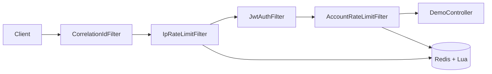

# Distributed Rate Limiter

[](https://github.com/muhammadahmed-01/DistributedRateLimiter/actions/workflows/ci.yml)


A Spring Boot service demonstrating **tiered rate limiting** (IP → JWT → account) using a **sliding-window log** algorithm executed atomically in **Redis via Lua**. Includes Prometheus metrics, Grafana dashboards, and k6 load tests.

---

## Architecture



Requests pass through cheap checks first: IP limiting before JWT parsing, JWT validation before account quotas. Blocked requests short-circuit early to minimize wasted work.

See [Design.md](Design.md) for algorithm comparison, trade-offs, and scaling notes.

---

## Features

- **IP rate limiting** — first line of defense (configurable limit/window)
- **JWT authentication** — optional Bearer token parsing; invalid tokens return `401`
- **Account rate limiting** — per-account quotas after successful auth
- **Atomic Redis+Lua** — sliding-window log with zero race conditions under concurrency
- **Prometheus metrics** — allowed/blocked/invalid counters + Redis latency histogram
- **Correlation IDs** — `X-Correlation-Id` header with MDC logging
- **Structured JSON errors** — consistent `401`, `429`, and `503` response bodies
- **Configurable Redis failure policy** — fail-closed (default) or fail-open

---

## Prerequisites

| Tool | Version |
|------|---------|
| Java | 21 |
| Maven | 3.9+ |
| Docker | 24+ (for Redis / full stack) |
| k6 | optional, for load tests |

---

## Quick Start

### 1. Redis only (local development)

```bash
docker compose --profile dev up -d
```

Copy environment variables from [`.env.example`](.env.example), then run:

```bash
mvn spring-boot:run -Dspring-boot.run.profiles=dev
```

### 2. Generate a JWT

```bash
mvn -q exec:java -Dexec.mainClass=com.example.DistributedRateLimiter.security.JwtGen
```

Uses `JWT_SIGNING_KEY` from the environment, or the dev default when `spring.profiles.active=dev`.

### 3. Test the endpoint

```bash
curl -H "Authorization: Bearer <token>" http://localhost:8080/api/hello
```

### 4. Full observability stack

```bash
docker compose --profile full up -d
```

| Service | URL |
|---------|-----|
| App | http://localhost:8080 |
| Prometheus | http://localhost:9090 |
| Grafana | http://localhost:3000 (dashboard auto-provisioned) |

---

## API Reference

### `GET /api/hello`

Returns a greeting string.

**Request headers**

| Header | Required | Description |
|--------|----------|-------------|
| `Authorization` | No | `Bearer <JWT>` — enables account-level rate limiting |
| `X-Forwarded-For` | No | Client IP when behind a trusted proxy (see `ratelimit.trusted-proxies`) |
| `X-Correlation-Id` | No | Request trace ID; generated if absent |

**Response headers (rate limited paths)**

| Header | Description |
|--------|-------------|
| `X-RateLimit-Limit` | Maximum requests allowed in the window |
| `X-RateLimit-Remaining` | Requests remaining |
| `X-RateLimit-Reset` | Approximate Unix timestamp when the window resets |
| `Retry-After` | Seconds to wait before retrying (on `429` / `503`) |

**Error responses**

| Status | Body `error` | When |
|--------|--------------|------|
| `401` | `invalid_token` | Malformed or invalid JWT |
| `429` | `rate_limited` | IP or account quota exceeded |
| `503` | `rate_limit_unavailable` | Redis down (fail-closed policy) |

---

## Configuration

| Property / Env Var | Default | Description |
|--------------------|---------|-------------|
| `REDIS_HOST` | `localhost` | Redis hostname |
| `JWT_SIGNING_KEY` | *(required in prod)* | HS256 signing key (min 32 chars) |
| `ratelimit.ip.limit` | `100` | Max requests per IP per window |
| `ratelimit.ip.windowSeconds` | `60` | IP window size (seconds) |
| `ratelimit.account.limit` | `10` | Max requests per account per window |
| `ratelimit.account.windowSeconds` | `60` | Account window size (seconds) |
| `ratelimit.redis.failure-policy` | `FAIL_CLOSED` | `FAIL_CLOSED` (503) or `FAIL_OPEN` (allow) |
| `ratelimit.trusted-proxies` | *(empty)* | Comma-separated proxy IPs allowed to set `X-Forwarded-For` |

---

## Observability

Metrics are exposed at `/actuator/prometheus`.

| Metric | Labels | Description |
|--------|--------|-------------|
| `rate_limit_requests_total` | `type`, `status` | Allowed/blocked/invalid decisions (`type`: ip, account, jwt) |
| `rate_limit_redis_latency_seconds` | `type` | Redis Lua script execution latency |
| `rate_limit_redis_errors_total` | — | Redis failures during rate limit checks |

Actuator endpoints: `/actuator/health`, `/actuator/info`, `/actuator/prometheus` (restricted in `prod` profile).

---

## Load Testing

```bash
k6 run load-tests/rate_limit_test.js
```

With a custom signing key:

```bash
k6 run -e JWT_SIGNING_KEY=your-key load-tests/rate_limit_test.js
```

Scenarios:

1. **IP limit** — exhausts IP quota, expects `429`
2. **JWT auth** — valid token (`200`) vs invalid token (`401`)
3. **Account limit** — exhausts per-account quota across a single IP
4. **Distributed race** — 50 VUs, unique IPs, shared account; proves Lua atomicity (exactly 10 succeed)

---

## Project Structure

```
src/main/java/com/example/DistributedRateLimiter/
├── config/          RedisConfig, WebFilterConfig, SecurityFilterConfig
├── controller/      DemoController
├── filter/          CorrelationIdFilter, IpRateLimitFilter, JwtAuthFilter, AccountRateLimitFilter
├── metrics/         RateLimitMetrics (Micrometer)
├── rateLimit/       SlidingWindowLogRateLimiter, RateLimitResponse
├── security/        SecurityConfig, JwtGen
└── util/            JsonErrorWriter
src/main/resources/
├── rate_limiter.lua
├── application.properties
└── logback-spring.xml
load-tests/          k6 scripts
grafana/             Dashboard + provisioning
```

---

## Operations

| Task | Command |
|------|---------|
| Run unit + integration tests | `mvn verify` |
| Build Docker image | `docker build -t distributed-rate-limiter .` |
| Redis only | `docker compose --profile dev up -d` |
| Full stack | `docker compose --profile full up -d` |
| Manual test (Windows) | `.\test_rate_limiter.ps1` |

**Note:** Account rate limiting requires a valid JWT (`accountId` claim). The `X-Account-Id` header is not used.

---

## Architecture Details

See [Design.md](Design.md) for:

- Rate limiting algorithm comparison table
- Why Redis + Lua for atomicity
- Filter ordering rationale
- Production scaling recommendations (Redis Sentinel, sliding-window counter, etc.)
- Secret management patterns (env vars vs AWS Secrets Manager / Vault)

---

## License

[MIT](LICENSE) — Copyright (c) 2026 Muhammad Ahmed
