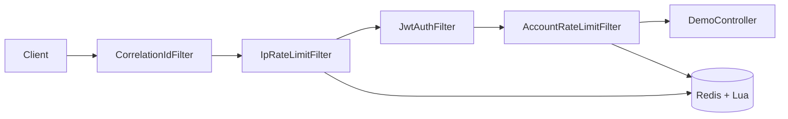

# ~77k Requests, 8/8 k6 PASS: Redis-Backed Distributed Rate Limiter

Public APIs need limits that stay correct across instances and under burst traffic. In-memory counters break at the second pod; fixed windows double-count at boundaries. This reference implementation enforces tiered limits (IP, JWT, account) with an atomic sliding-window log in Redis + Lua, then proves behavior with an eight-profile k6 suite and Grafana totals that reconcile to Prometheus (±1%).

Measured on 2026-06-13 against the Docker full stack (IP **2000**/min, account **200**/min). Full artifact: [load-tests/K6_RESULTS.md](load-tests/K6_RESULTS.md).

[](https://github.com/muhammadahmed-01/DistributedRateLimiter/actions/workflows/ci.yml)


---

## Results at a glance

| Signal | Measured result | Source |
|--------|-----------------|--------|
| k6 suite | **8/8 PASS**, **0 check failures** | [K6_RESULTS.md](load-tests/K6_RESULTS.md) |
| Requests exercised | **~77,000** across isolated, combo, and full-pipeline profiles | Same |
| Full-pipeline burst | **~60,900** requests; **400** allowed; **58,763** IP + **1,600** account blocks | Same (profile 8) |
| Peak IP block rate | **~1,100 req/s** observed during 3,000 req/s race phase | Same (Grafana alignment) |
| Prometheus totals (one suite) | IP **~13,200** allowed / **~64,500** blocked; account **~2,200** / **~2,360**; JWT invalid **~602** | Same |
| Observability | Grafana **Totals** panels match k6 counters (±1%) | [docs/images/grafana-dashboard.png](docs/images/grafana-dashboard.png) |
| CI | Unit, integration, and Testcontainers tests on every push | GitHub Actions |


---

## The problem

**Boundary bursts:** Fixed-window counters let a client send 2× the intended limit by straddling window edges.

**No shared state:** Per-process counters diverge the moment you run more than one instance.

**Wrong layer order:** Parsing JWTs before rejecting abusive IPs wastes CPU on traffic you already know is hostile.

**No proof under load:** A unit test on mocked Redis does not show whether limits hold when 3,000 requests per second hit one client IP.

---

## Design



### Sliding-window log in Redis + Lua

Each allow/block decision runs as one atomic Lua script: trim expired timestamps, count entries in the window, append or reject. No read-modify-write race when many pods hit the same key.

| Approach | Chosen? | Why |
|----------|---------|-----|
| **Sliding-window log** | Yes | Exact at window edges; acceptable memory on a security boundary |
| Fixed window | No | 2× burst exploit at boundaries |
| Token bucket | No | Hard per-minute caps matter more than controlled burst here |
| In-memory only | No | Breaks with horizontal scale |

### Tiered filter chain

1. **IP** (cheapest): block floods before auth.
2. **JWT**: reject invalid tokens with `401`.
3. **Account**: per-user quota after identity is known.

Blocked requests exit early with structured JSON, standard rate-limit headers, and correlation IDs. Algorithm trade-offs and scale paths: [Design.md](Design.md).

---

## Production lessons

These are the failure modes worth deciding upfront before shipping a Redis-backed limiter:

- **Redis down:** Default is **fail-closed** (`503`, `rate_limit_unavailable`). Set `ratelimit.redis.failure-policy=FAIL_OPEN` only when you accept unprotected traffic during outages (availability over protection).
- **Single Redis instance:** One node is a SPOF. Production path: Sentinel or Cluster plus explicit fail-open/fail-closed policy per product risk.
- **Clock skew:** Sliding-window log uses wall-clock timestamps in Redis. Large skew between app hosts and Redis can admit extra requests or reject early. NTP on all nodes; monitor `rate_limit_redis_errors_total`.
- **Hot keys:** One viral account or shared NAT concentrates traffic on one Redis key. At scale, shard keys or move high-frequency endpoints to edge/proxy limits.
- **Filter order matters:** IP exhaustion blocks authenticated traffic too (by design). k6 `ip_jwt_combo_test.js` proves JWT never bypasses an exhausted IP bucket.
- **Health bypass:** `/actuator/health` skips IP limiting so orchestrators do not kill the pod when the API quota is exhausted (`health_bypass_test.js`).
- **Memory growth:** SWL stores one entry per request per key. High-traffic keys need sliding-window counter or proxy-layer limits (see Design.md §10).

---

## Documentation

| Resource | Path |
|----------|------|
| k6 measured results (all profiles) | [load-tests/K6_RESULTS.md](load-tests/K6_RESULTS.md) |
| Design trade-offs and scale paths | [Design.md](Design.md) |
| Portfolio preview (HTML) | [docs/portfolio-preview.html](docs/portfolio-preview.html) |
| Rate-limit audit checklist | [docs/RATE-LIMIT-AUDIT-CHECKLIST.md](docs/RATE-LIMIT-AUDIT-CHECKLIST.md) |
| Phase 1 rate-limit SOW | [docs/PHASE-1-RATE-LIMIT-SOW.md](docs/PHASE-1-RATE-LIMIT-SOW.md) |
| Grafana screenshot | [docs/images/grafana-dashboard.png](docs/images/grafana-dashboard.png) |
| Upwork blurb | [UPWORK-BLURB.md](UPWORK-BLURB.md) |
| Portfolio assets | [PORTFOLIO-ASSETS.md](PORTFOLIO-ASSETS.md) |

---

## Run it locally

### One command (full stack)

```bash
docker compose --profile full up --build -d
```

Wait for health, then:

```bash
curl -sf http://localhost:8080/actuator/health
mvn -q exec:java -Dexec.mainClass=com.example.DistributedRateLimiter.security.JwtGen
curl -H "Authorization: Bearer <token>" http://localhost:8080/api/hello
```

| Service | URL |
|---------|-----|
| App | http://localhost:8080 |
| Prometheus | http://localhost:9090 |
| Grafana | http://localhost:3001 (dashboard `rate-limiter-v2`) |

**Port conflict:** If `:8080` is taken, stop the other stack first (`docker compose down` in the other project) or change the host port in `docker-compose.yml`.

### Redis only (local dev)

```bash
docker compose --profile dev up -d
```

Copy variables from [`.env.example`](.env.example), then `mvn spring-boot:run -Dspring-boot.run.profiles=dev`.

### Load test (k6)

```powershell
.\load-tests\run-all-tests.ps1
```

Open Grafana, set **Last 10–15 minutes**, compare **Totals** bargauges to [K6_RESULTS.md](load-tests/K6_RESULTS.md).

---

## API reference

### `GET /api/hello`

Demo endpoint behind the full filter chain.

**Request headers**

| Header | Required | Description |
|--------|----------|-------------|
| `Authorization` | No | `Bearer <JWT>` for account-level limiting |
| `X-Forwarded-For` | No | Client IP behind trusted proxy (`ratelimit.trusted-proxies`) |
| `X-Correlation-Id` | No | Trace ID; generated if absent |

**Response headers (rate-limited paths)**

| Header | Description |
|--------|-------------|
| `X-RateLimit-Limit` | Max requests in the window |
| `X-RateLimit-Remaining` | Requests remaining |
| `X-RateLimit-Reset` | Approximate Unix reset time |
| `Retry-After` | Seconds to wait (`429` / `503`) |

**Error responses**

| Status | Body `error` | When |
|--------|--------------|------|
| `401` | `invalid_token` | Malformed or invalid JWT |
| `429` | `rate_limited` | IP or account quota exceeded |
| `503` | `rate_limit_unavailable` | Redis down (fail-closed) |

---

## Configuration

| Property / Env Var | Default | Description |
|--------------------|---------|-------------|
| `REDIS_HOST` | `localhost` | Redis hostname |
| `JWT_SIGNING_KEY` | *(required in prod)* | HS256 key (min 32 chars) |
| `ratelimit.ip.limit` | `2000` | Max requests per IP per window (`RATELIMIT_IP_LIMIT`) |
| `ratelimit.ip.windowSeconds` | `60` | IP window (seconds) |
| `ratelimit.account.limit` | `200` | Max requests per account (`RATELIMIT_ACCOUNT_LIMIT`) |
| `ratelimit.account.windowSeconds` | `60` | Account window (seconds) |
| `ratelimit.redis.failure-policy` | `FAIL_CLOSED` | `FAIL_CLOSED` (503) or `FAIL_OPEN` |
| `ratelimit.trusted-proxies` | *(empty)* | Proxies allowed to set `X-Forwarded-For` |

---

## Observability

Metrics at `/actuator/prometheus`:

| Metric | Labels | Description |
|--------|--------|-------------|
| `rate_limit_requests_total` | `type`, `status` | Allowed/blocked/invalid (`type`: ip, account, jwt) |
| `rate_limit_redis_latency_seconds` | `type`, `quantile` | Redis Lua latency |
| `rate_limit_redis_errors_total` | (none) | Redis failures during checks |

Use **Totals** panels (`increase(...[$__range])`) to validate against k6, not per-minute rate peaks (brief bursts show as separate spikes per filter phase).

---

## Stack

- Java 21, Spring Boot 3.5, Spring WebFlux filters
- Redis 7 + Lua sliding-window log
- Prometheus, Grafana, k6
- Docker Compose (`dev` and `full` profiles)

---

## License

[MIT](LICENSE). Copyright (c) 2026 Muhammad Ahmed
