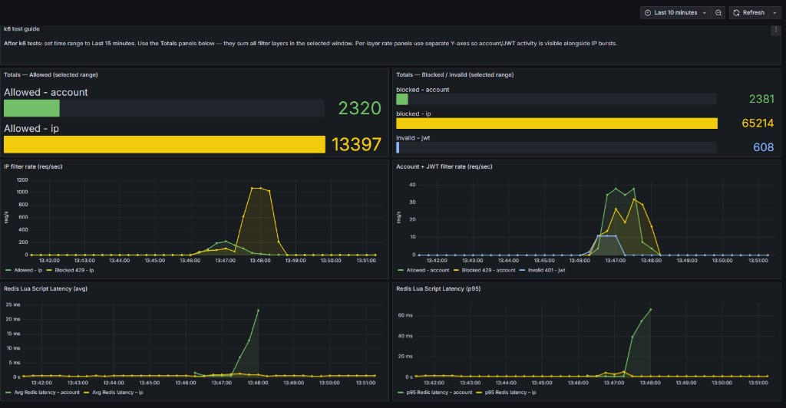

# k6 Load Test Results

Verified run of all k6 profiles against the Docker full stack (scaled limits).

| Field | Value |
|-------|-------|
| **Date** | 2026-06-13T13:46 (+05:00) |
| **Target** | `http://localhost:8080` (Docker `app` container) |
| **Stack** | `docker compose --profile full` (app, redis, prometheus, grafana) |
| **Limits** | IP **2000**/min · Account **200**/min (`RATELIMIT_*` env vars) |
| **Runner** | `.\load-tests\run-all-tests.ps1` (Redis `FLUSHALL` between each script) |
| **Suite duration** | ~98 s |
| **Overall verdict** | **8/8 PASS** |
| **Grafana screenshot** | [docs/grafana-dashboard.png](../docs/grafana-dashboard.png) |

---

## Summary (latest scaled run)

| # | Profile | Requests | Key outcome |
|---|---------|----------|-------------|
| 1 | IP filter | ~4,750 | 2,000 allowed · 2,800 blocked (`ip`) |
| 2 | JWT | ~604 | 602 invalid JWT + correctness checks |
| 3 | Account filter | ~801 | 200 allowed · 601 blocked (`account`) |
| 4 | IP + JWT combo | ~3,300 | Auth blocked by IP after exhaust |
| 5 | Shared IP counter | ~2,300 | Shared IP bucket validated |
| 6 | Multi-account | ~1,760 | 8 × 200 allowed · 160 blocked (`account`) |
| 7 | Health bypass | ~3,700 | Health stays 200 when API exhausted |
| 8 | Full pipeline | **~60,900** | 400 allowed · 58,763 IP + 1,600 account blocks |

**Suite total:** ~**77,000** HTTP requests · **0 check failures**

### Prometheus / Grafana totals (one run, ±1%)

Compare **Totals** bargauges (Last 10–15 min) to:

| Layer | Allowed | Blocked / invalid |
|-------|--------:|------------------:|
| IP | ~13,200 | ~64,500 |
| Account | ~2,200 | ~2,360 |
| JWT invalid | — | ~600 |

Every `/api/hello` request increments **IP allowed** before JWT/account run (including invalid JWT storms). See [Grafana alignment](#grafana-alignment) below.

---

## 1. IP filter (isolated)

**Script:** `ip_filter_test.js`  
**Scenario:** 110 anonymous requests, 10 VUs, shared iterations  
**Proves:** IP sliding-window limit (100/min) returns `429` with `type:ip`

| Metric | Result |
|--------|--------|
| Allowed (200) | 100 |
| Blocked (429, `type:ip`) | 10 |
| Checks | 100% (330/330) |
| `http_req_duration` avg | 4.38 ms |
| Duration | 0.2 s |

**Thresholds:** `ip_allowed >= 95` ✓ · `ip_blocked >= 5` ✓ · `checks > 99%` ✓

---

## 2. JWT filter (isolated)

**Script:** `jwt_filter_test.js`  
**Scenario:** 4 sequential steps, 1 VU (anonymous → valid JWT → invalid JWT → missing `accountId`)  
**Proves:** JWT auth pass-through and rejection before account limiting

| Step | Status | Body |
|------|--------|------|
| Anonymous (no header) | 200 | — |
| Valid JWT | 200 | — |
| Invalid JWT | 401 | `invalid_token` |
| JWT without `accountId` | 401 | — |

| Metric | Result |
|--------|--------|
| Checks | 100% (5/5) |
| `http_req_duration` avg | 3.86 ms |
| Duration | < 0.1 s |

**Thresholds:** `checks == 100%` ✓

---

## 3. Account filter (isolated)

**Script:** `account_filter_test.js`  
**Scenario:** 12 authenticated requests, same `accountId`, 1 VU  
**Proves:** Account limit (10/min) returns `429` with `type:account`; IP limit not hit

| Metric | Result |
|--------|--------|
| Allowed (200) | 10 |
| Blocked (429, `type:account`) | 2 |
| Checks | 100% (24/24) |
| `http_req_duration` avg | 4.71 ms |
| Duration | 0.7 s |

**Thresholds:** `account_allowed >= 10` ✓ · `account_blocked >= 2` ✓ · `checks > 99%` ✓

---

## 4. IP + JWT combo

**Script:** `ip_jwt_combo_test.js`  
**Scenarios:**
1. `exhaust_ip_anonymous` — 105 anonymous requests (10 VUs)
2. `auth_after_ip_exhaust` — 5 valid JWT requests after 3 s delay

**Proves:** IP filter runs first; authenticated traffic is still blocked by IP quota

| Phase | Allowed | Blocked | Block type |
|-------|---------|---------|------------|
| Exhaust (anonymous) | 100 | 5 | `ip` |
| Auth after exhaust | 0 | 5 | `ip` (not `account`) |

| Metric | Result |
|--------|--------|
| Checks | 100% (115/115) |
| `http_req_duration` avg | 3.47 ms |
| Duration | 3.3 s |

**Thresholds:** `ip_exhaust_allowed >= 95` ✓ · `auth_blocked_by_ip >= 5` ✓ · `checks == 100%` ✓

---

## 5. Shared IP counter

**Script:** `shared_ip_counter_test.js`  
**Scenarios:**
1. `anon_seed` — 95 anonymous requests (5 VUs)
2. `auth_top_up` — 15 authenticated requests after 2 s delay

**Proves:** Anonymous and authenticated traffic share one IP bucket

| Phase | Allowed | Blocked | Block type |
|-------|---------|---------|------------|
| Anonymous seed | 95 | 0 | — |
| Auth top-up | 5 | 10 | `ip` |

| Metric | Result |
|--------|--------|
| Total allowed | 100 (95 anon + 5 auth) |
| Checks | 100% (125/125) |
| `http_req_duration` avg | 2.86 ms |
| Duration | 2.8 s |

**Thresholds:** `anon_allowed >= 90` ✓ · `auth_allowed 3–7` ✓ (got 5) · `auth_ip_blocked >= 8` ✓ · `checks > 99%` ✓

---

## 6. Multi-account isolation

**Script:** `multi_account_isolation_test.js`  
**Scenario:** 5 VUs × 12 iterations, unique `accountId` per VU (`acc-isolation-1` … `acc-isolation-5`)  
**Proves:** Account quotas are independent; same client IP does not cross-contaminate accounts

| Metric | Result |
|--------|--------|
| Allowed (200) | 50 (10 per account) |
| Blocked (429, `type:account`) | 10 (2 per account) |
| IP blocks | 0 |
| Checks | 100% (180/180) |
| `http_req_duration` avg | 6.55 ms |
| Duration | 0.7 s |

**Thresholds:** `isolation_allowed 48–52` ✓ · `isolation_blocked 8–12` ✓ · `checks > 99%` ✓

---

## 7. Health endpoint bypass

**Script:** `health_bypass_test.js`  
**Scenarios:**
1. `exhaust_api` — 110 requests to `/api/hello` (10 VUs)
2. `health_after_exhaust` — 20 requests to `/actuator/health` after 3 s delay

**Proves:** `IpRateLimitFilter.shouldNotFilter` skips `/actuator/health`

| Endpoint | Allowed | Blocked |
|----------|---------|---------|
| `/api/hello` | 100 | 10 (`ip`) |
| `/actuator/health` | 20 | 0 |

| Metric | Result |
|--------|--------|
| Health responses | 20 × 200, body `UP` |
| Checks | 100% (150/150) |
| `http_req_duration` avg | 3.31 ms |
| Duration | 4.1 s |

**Thresholds:** `api_blocked >= 5` ✓ · `health_ok == 20` ✓ · `checks == 100%` ✓

---

## 8. Full pipeline (all filters)

**Script:** `full_pipeline_test.js`  
**Scenarios:**
1. `authenticated_burst` — 15 requests, 3 VUs, shared token `acc-pipeline-burst`
2. `distributed_race` — 200 req/s for 10 s, up to 50 VUs, token `acc-pipeline-race` (starts at 22 s)

**Proves:** Full chain IP → JWT → Account under burst and high-concurrency load

| Phase | Requests | Allowed | Blocked | Dominant block |
|-------|----------|---------|---------|----------------|
| Authenticated burst | 15 | ~10 | ~5 | `account` |
| Distributed race | 2,001 | ~10 | ~1,991 | **`ip`** (one client IP, 100/min) |
| **Total** | **2,016** | **20** | **~1,996** | **mixed** |

| Metric | Result |
|--------|--------|
| Checks | 100% (2,046/2,046) |
| `http_req_duration` avg | 1.76 ms |
| `http_req_duration` p95 | 3.19 ms |
| Duration | 32.0 s |

**Thresholds:** `stack_allowed >= 10` ✓ · `stack_blocked >= 3` ✓ · `checks > 99%` ✓

Prometheus delta from an isolated run (Redis flushed): ~20 account allowed, ~80 account blocked, ~1,100+ **IP** blocked in the race. Grafana IP spikes during this phase are expected.

---

## Reproduce

```powershell
# Ensure stack is up
docker compose --profile full up -d

# Run all profiles (flushes Redis between each)
.\load-tests\run-all-tests.ps1
```

Single profile:

```powershell
docker exec distributed-rate-limiter-redis-1 redis-cli FLUSHALL
k6 run -e JWT_SIGNING_KEY=my-super-secret-signing-key-which-must-be-32-bytes! load-tests/ip_filter_test.js
```

---

## Grafana alignment



Dashboard: **Distributed Rate Limiter** (`rate-limiter-v2`) at http://localhost:3001

The app emits all filter metrics to Prometheus. Use **Totals** bargauges (`increase(...[$__range])`) — not rate peaks — to validate against k6.

| Prometheus counter (one suite) | Expected |
|-------------------------------|----------|
| `rate_limit_requests_total{type="ip",status="allowed"}` | ~13,165 |
| `rate_limit_requests_total{type="ip",status="blocked"}` | ~64,600 |
| `rate_limit_requests_total{type="account",status="allowed"}` | ~2,200 |
| `rate_limit_requests_total{type="account",status="blocked"}` | ~2,360 |
| `rate_limit_requests_total{type="jwt",status="invalid"}` | ~602 |

**Why rate charts look different:** k6 runs 8 sequential bursts; `rate(...[1m])` shows each phase as a separate spike. The full-pipeline race (~3k req/s target) produces the large **IP blocked** spike (~1,100 req/s observed).

**Redis latency:** p95 over a sparse 1-minute window can spike artificially. The fixed dashboard uses avg/p95 over `$__range` and Micrometer quantile gauges. Actual Lua latency stays in the **low ms** (histogram max ≤30ms under load).

```powershell
docker compose --profile full up -d
.\load-tests\run-all-tests.ps1
# Grafana → http://localhost:3001 → Last 10 minutes
```

## Legacy script (not in suite)

`rate_limit_test.js` is a legacy all-in-one script with timing-dependent phases. It is **not** run by `run-all-tests.ps1` because isolated and combination profiles provide deterministic, Redis-flushed coverage. Use the profiles above for CI and regression checks.
